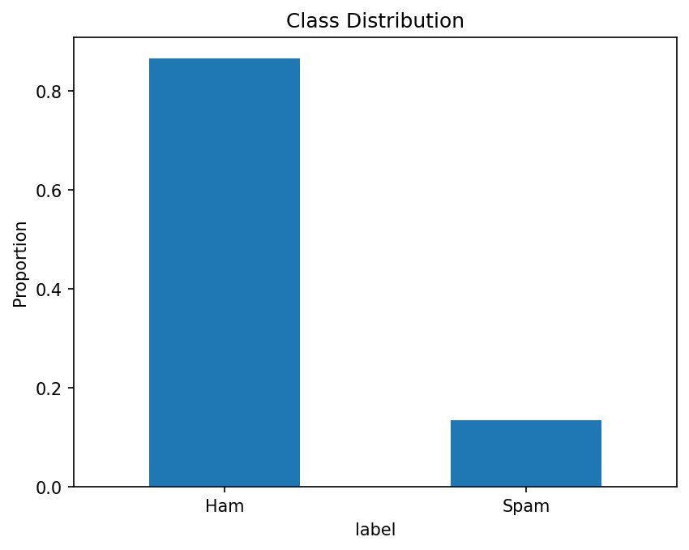

# 📧 Spam vs. Ham – NLP Mini‑Project

A beginner‑friendly walkthrough that turns raw SMS messages into a spam filter using
**TF‑IDF features** and a **Random Forest** classifier.



## Quick start

```bash
python -m venv .venv && source .venv/bin/activate
pip install -r requirements.txt
jupyter notebook spam_rf_clean.ipynb
```

## Project structure

| File | Purpose |
|------|---------|
| `spam_rf_clean.ipynb` | Step‑by‑step notebook (data prep → modelling → evaluation) |
| `requirements.txt`             | Minimal Python dependencies |
| `class_balance.png`            | Auto‑generated plot of label distribution |

## Notebook outline

This project follows a classic NLP classification flow using TF-IDF and Random Forests. It now includes full evaluation metrics for the model's performance on the test set.

| Section | What you’ll learn |
|---------|-------------------|
| 1. Load data | Pandas basics, class balance |
| 2. Pre‑processing | Cleaning punctuation, lower‑casing |
| 3. Vectorisation | TF‑IDF (unigrams + bigrams) |
| 4. Baseline model | Random Forest training & evaluation |
| 5. Feature selection | Importance > 0.001  |
| 6. GridSearchCV | Light hyper‑parameter tuning |
| 7. Final metrics | Accuracy, precision, recall, F1-score, confusion matrix |

## Why Random Forest?

* Easy to interpret via **feature importances**  
* Handles high‑dimensional sparse inputs without heavy tuning  
* A practical first step before deeper models (Logistic Regression, SVM, BERT)

## Next steps 🚀

1. Compare with **Linear SVM** or **LogisticRegression**.  
2. Try `class_weight="balanced"` to mitigate class imbalance.  
3. Add character n‑grams to capture obfuscated spam (e.g. `v1agra`).  
4. Persist the trained pipeline with `joblib` and expose it as an API.  
